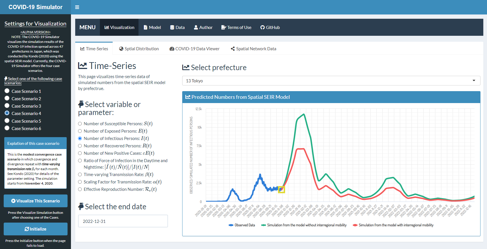

# COVID-19 Simulator in Japan

## Shiny Web Application
I developed a spatial Susceptible-Exposed-Infectious-Recovered (SEIR) model that analyzes the effect of interregional mobility on the spatial spread of the COVID-19 outbreak in Japan (Kondo, 2020). The numerical simulations conducted in this study are provided on the web site "COVID-19 Simulator in Japan."  
URL: https://keisuke-kondo.shinyapps.io/covid19-simulator-japan/

## Replication Files
The R code and data used in Kondo (2020) are available on GitHub.  
URL: [https://github.com/keisukekondokk/spatial-seir](https://github.com/keisukekondokk/spatial-seir)

## Terms of Use

Users (hereinafter referred to as the User or Users depending on context) of the content on this web site (hereinafter referred to as the Content) are required to conform to the terms of use described herein (hereinafter referred to as the Terms of Use). Furthermore, use of the Content constitutes agreement by the User with the Terms of Use. The contents of the Terms of Use are subject to change without prior notice.

### Copyright
The copyright of the developed code belongs to Keisuke Kondo.

### Copyright of Third Parties
Keisuke Kondo developed the Content based on the information on From-To Analysis on the Regional Economy and Society Analyzing System (RESAS), which is freely available using the RESAS API. The original data of From-To Analysis is based on Mobile Spatial Statistics&reg; of NTT DOCOMO. The shapefile of the 47 prefectures in Japan was taken from the Portal Site of Official Statistics of Japan, e-Stat. Users must confirm the terms of use of the RESAS and the e-Stat, prior to using the Content.

### Disclaimer
<ul>
<li>Keisuke Kondo makes the utmost effort to maintain, but nevertheless does not guarantee, the accuracy, completeness, integrity, usability, and recency of the Content.</li>
<li>Keisuke Kondo and any organization to which Keisuke Kondo belongs hereby disclaim responsibility and liability for any loss or damage that may be incurred by Users as a result of using the Content. Keisuke Kondo and any organization to which Keisuke Kondo belongs are neither responsible nor liable for any loss or damage that a User of the Content may cause to any third party as a result of using the Content</li>
<li>The Content may be modified, moved or deleted without prior notice.</li>
</ul>

## Author
Keisuke Kondo  
Senior Fellow, Research Institute of Economy, Trade and Industry  
Email: kondo-keisuke@rieti.go.jp  
URL: https://sites.google.com/site/keisukekondokk/  

## Reference
Kondo, Keisuke (2020) "Simulating the Impacts of Interregional Mobility Restriction on Spatial Spread of COVID-19 in Japan," RIETI Discussion Paper (forthcoming)  
https://www.rieti.go.jp/  
